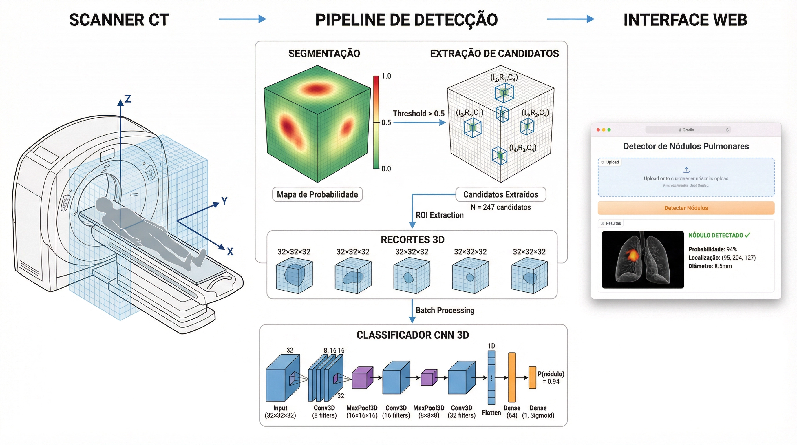
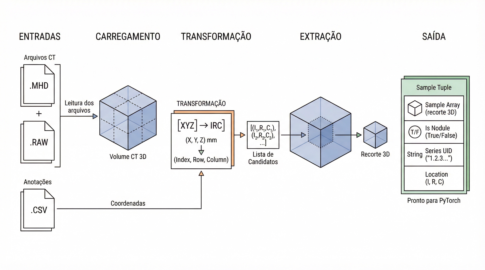

# Deep Learning Lung Cancer Detection

<a href="https://docs.microsoft.com/en-us/cpp/?view=msvc-170" target="_blank" rel="noreferrer"></a><a href="https://www.python.org/" target="_blank" rel="noreferrer"></a><a href="https://www.tensorflow.org/" target="_blank" rel="noreferrer"></a><a href="https://pytorch.org/" target="_blank" rel="noreferrer"></a><a href="https://aws.amazon.com" target="_blank" rel="noreferrer"></a><a href="https://cloud.google.com/" target="_blank" rel="noreferrer"></a> </p>
<br>


Binäre Klassifizierungspipeline (Knoten vs. Nicht-Knoten) bei Computertomographien unter Verwendung des LUNA16-Datensatzes [LUNA16](https://luna16.grand-challenge.org/)  und PyTorch.


<br>

## Sumário

- [Über das Projekt](#Über-das-Projekt)
- [Tomografias Computadorizadas](#tomografias-computadorizadas)
- [Pipeline de Dados](#pipeline-de-dados)
- [Progresso](#progresso)
- [Estrutura do Projeto](#estrutura-do-projeto)
- [Instalação e Configuração](#instalação-e-configuração)

<br>

## Über das Projekt

Das Projekt implementiert eine vollständige Pipeline zur Erkennung von Lungenknoten anhand von Computertomografien (CT-Scans), von der Datenerfassung und -aufbereitung bis hin zur Bereitstellung einer interaktiven Anwendung mit Gradio.

<p align="center">
  
</p>
<p align="center"><em>Übersicht über die Pipeline – vom rohen CT-Scan bis zur Klassifizierung durch ein 3D-CNN.</em></p>

Der Ansatz nutzt vorberechnete Kandidaten, die vom LUNA16-Wettbewerb bereitgestellt werden (~551.000 XYZ-Koordinaten). Jeder Kandidat wird als 3D-Ausschnitt mit 32x48x48 Voxeln extrahiert und von einem 3D-CNN als Knoten oder Nicht-Knoten klassifiziert. Wir führen in der Hauptpipeline weder Segmentierung noch Erkennung durch – die Kandidaten werden bereits im Rahmen des LUNA16-Wettbewerbs vorberechnet.

<br>

## Tomografias Computadorizadas

<p align="center">
  
</p>
<p align="center"><em>Uma tomografia é composta por centenas de slices axiais empilhados, formando um volume 3D.</em></p>

Uma tomografia computadorizada (CT scan) gera um volume 3D do corpo do paciente. Cada "fatia" (slice) é uma imagem 2D, e a pilha de fatias forma o volume completo. Os valores de cada voxel são medidos em **Unidades Hounsfield (HU)** — uma escala onde o ar vale -1000 HU, a água vale 0 HU e o osso pode chegar a +1000 HU.

No dataset LUNA16, cada CT scan é armazenado como um par de arquivos `.mhd` (metadados) e `.raw` (voxels). O desafio fornece dois CSVs: `candidates.csv` com ~551 mil coordenadas XYZ de pontos suspeitos, e `annotations.csv` com os nódulos confirmados por radiologistas.

<br>

## Pipeline de Dados

<p align="center">
  
</p>
<p align="center"><em>Pipeline completo: dos arquivos brutos até o sample pronto para a rede neural.</em></p>

O caminho dos dados brutos até a entrada da rede neural segue estas etapas:

1. **Carregar o CT scan** — leitura do `.mhd` com SimpleITK, obtendo o array 3D e os metadados (origin, spacing, direction)
2. **Converter coordenadas** — as coordenadas XYZ (milímetros do paciente) são convertidas para índices IRC (index, row, col) do array NumPy
3. **Extrair o crop 3D** — um patch de 32x48x48 voxels é recortado ao redor de cada candidato
4. **Criar o sample PyTorch** — o crop vira um tensor `[1, 32, 48, 48]`, pronto para o DataLoader

<br>

## Progresso

- [x] Download e organização do dataset LUNA16
- [x] Análise exploratória e unificação das fontes de dados
- [x] Carregamento de CT scans e conversão de coordenadas
- [x] Construção do PyTorch Dataset com extração de crops 3D
- [x] Arquitetura da CNN 3D para classificação de nódulos
- [x] Loop de treinamento com balanceamento e data augmentation
- [x] Treinamento completo em GPU
- [x] Avaliação do modelo e análise de erros
- [x] Deploy com Gradio

<br>

## Estrutura do Projeto

```
.
├── notebooks/                 Jupyter notebooks do curso
│   ├── 01_download_luna16
│   ├── 02_explore_csv_data
│   ├── 03_analyze_coordinates
│   ├── 04_ct_scan_to_dataset
│   ├── 05_model_architecture
│   ├── 06_training
│   ├── 07_colab_training
│   ├── 08_model_evaluation
│   └── 09_gradio_deploy
├── src/                       Módulos Python (gerados via %%writefile)
│   ├── luna_data.py
│   ├── model.py
│   ├── training.py
│   └── inference.py
├── app.py                     Aplicação Gradio (gerado via %%writefile)
├── tests/                     Testes automatizados
├── checkpoints/               Checkpoints do modelo treinado
├── data/                      Dataset LUNA16 (não versionado)
├── docs/                      Diagramas e referências
└── pyproject.toml             Dependências e configuração
```

<br>

## Instalação e Configuração

1. Clonar o repositório para a sua máquina local:

```bash
git clone https://github.com/carlosfab/bootcamp-deep-learning.git
cd bootcamp-deep-learning
```

2. Instalar as dependências com [UV](https://docs.astral.sh/uv/):

```bash
uv sync
```

3. Ativar o ambiente virtual:

```bash
source .venv/bin/activate
```

4. Rodar os testes para verificar que está tudo funcionando:

```bash
pytest tests/ -v
```

5. O dataset LUNA16 (~111 GB) deve ser baixado separadamente. O notebook `01_download_luna16.ipynb` contém as instruções de download via API.

---

Projeto desenvolvido como parte do Bootcamp de Deep Learning para Visão Computacional da [STAR Research Institute](https://starresearch.institute).
