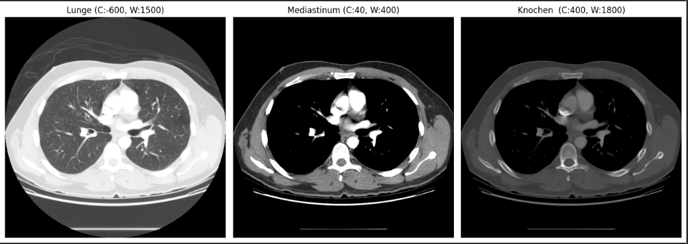

# Deep Learning Lung Cancer Detection
**Work in Progress** 

<p align="left">


</p>


Binäre Klassifizierungspipeline (Knoten vs. Nicht-Knoten) bei Computertomographien unter Verwendung des LUNA16-Datensatzes [LUNA16](https://luna16.grand-challenge.org/)  und PyTorch.


<br>

## Inhaltsverzeichnis

- [Über das Projekt](#Über-das-Projekt)
- [Computertomographie](#Computertomographie)
  - [Was ist eine 3D-Tomographie?](#was-ist-eine-3d-tomographie)
  - [Räumliche Metadaten: Spacing und Origin](#räumliche-metadaten-spacing-und-origin)
  - [Anzeigen von Schnitten des Volumens](#anzeigen-von-schnitten-des-volumens)
  - [Fensterung (Windowing)](#fensterung-windowing)
- [Datenpipeline](#Datenpipeline)
- [Fortschritt](#Fortschritt)
- [Projektstruktur](#Projektstruktur)
- [Installation und Konfiguration](#Installation-und-Konfiguration)

<br>

## Über das Projekt

Das Projekt implementiert eine vollständige Pipeline zur Erkennung von Lungenknoten anhand von Computertomografien (CT-Scans), von der Datenerfassung und -aufbereitung bis hin zur Bereitstellung einer interaktiven Anwendung mit Gradio.

<p align="center">
  
</p>
<p align="center"><em>Übersicht über die Pipeline – vom rohen CT-Scan bis zur Klassifizierung durch ein 3D-CNN.</em></p>

Der Ansatz nutzt vorberechnete Kandidaten, die vom LUNA16-Wettbewerb bereitgestellt werden (~551.000 XYZ-Koordinaten). Jeder Kandidat wird als 3D-Ausschnitt mit 32x48x48 Voxeln extrahiert und von einem 3D-CNN als Knoten oder Nicht-Knoten klassifiziert. Wir führen in der Hauptpipeline weder Segmentierung noch Erkennung durch – die Kandidaten werden bereits im Rahmen des LUNA16-Wettbewerbs vorberechnet.

<br>

## Computertomographie

<p align="center">
  
</p>
<p align="center"><em>Ein CT-Scan besteht aus Hunderten von übereinandergestapelten axialen Schichten, die ein 3D-Volumen bilden.</em></p>

Ein Computertomographie-Scan (CT-Scan) erzeugt ein 3D-Volumen des Körpers des Patienten. Jede „Scheibe“ (Slice) ist ein 2D-Bild, und der Stapel aus Scheiben bildet das gesamte Volumen. Die Werte jedes Voxels werden in Hounsfield-Einheiten (HU) gemessen – einer Skala, auf der Luft -1000 HU, Wasser 0 HU und Knochen bis zu +1000 HU beträgt.

Im Datensatz LUNA16 wird jeder CT-Scan als Paar aus einer .mhd-Datei (Metadaten) und einer .raw-Datei (Voxel) gespeichert. Die Aufgabe stellt zwei CSV-Dateien bereit: candidates.csv mit ~551.000 XYZ-Koordinaten verdächtiger Punkte und annotations.csv mit den von Radiologen bestätigten Knoten.

<br>

## Datenpipeline

<p align="center">
  
</p>
<p align="center"><em>Vollständige Pipeline: von den Rohdateien bis zum für das neuronale Netz bereitgestellten Sample.</em></p>

Der Weg der Rohdaten bis zum Eingang des neuronalen Netzes umfasst folgende Schritte:

1. **CT-Scan laden** — Einlesen der `.mhd-Datei` mit SimpleITK, um das 3D-Array und die Metadaten (Origin, Spacing, Direction) zu erhalten.
2. **Koordinaten konvertieren** — Die XYZ-Koordinaten (Millimeter des Patienten) werden in IRC-Indizes (Index, Row, Col) des NumPy-Arrays konvertiert.
3. **3D-Ausschnitt extrahieren** — ein Ausschnitt (Patch) von 32x48x48 Voxeln wird um jeden Kandidaten herum ausgeschnitten.
4. **PyTorch-Sample erstellen** — der Ausschnitt wird zu einem Tensor `[1, 32, 48, 48]`, bereit für den DataLoader.

<br>

Ein CT-Scan ist im Wesentlichen ein dreidimensionales Array, in dem jedes Voxel die Röntgenstrahlabschwächung in Hounsfield-Einheiten quantifiziert. Diese standardisierte numerische Darstellung ermöglicht es, anatomische Strukturen zu segmentieren, neuronale Netze zur Erkennung von Läsionen zu trainieren und reproduzierbare Analyse-Pipelines zu erstellen – alles auf der Grundlage von Operationen mit NumPy-Arrays. 

## Was ist eine 3D-Tomographie?

Eine Computertomographie (CT-Scan) ist eine Untersuchung, die ein 3D-Volumen des Körperinneren erzeugt. Das Gerät sendet Röntgenstrahlen aus verschiedenen Winkeln aus und rekonstruiert eine Reihe von Querschnitten des Patienten.

In der Praxis ist jeder CT-Scan, den Sie in Python bearbeiten werden, ein dreidimensionales NumPy-Array. Jede Position in diesem Array ist ein Voxel (das 3D-Äquivalent eines Pixels), und der gespeicherte numerische Wert wird in Hounsfield-Einheiten (HU) gemessen, einer standardisierten physikalischen Skala:

- Luft: −1000 HU
- Fett: −120 bis −60 HU
- Wasser: 0 HU
- Weichgewebe (Muskeln, Organe): +40 bis +80 HU
- Aufgeblähte Lunge: −950 bis −500 HU
- Kompakter Knochen: +1000 HU oder mehr

Im Gegensatz zu gewöhnlichen Bildern (bei denen Pixelwerte willkürlich sind) hat bei einem CT-Scan jede Zahl eine physikalische Bedeutung. Diese Eigenschaft ermöglicht es, anatomische Strukturen durch einfache Schwellenwertoperationen herauszufiltern.


<p align="center">
  
</p>
<p align="center"><em>Pixelwerte in Hounsfield-Einheiten (HU)</em></p>

<br>

## Räumliche Metadaten: Spacing und Origin

Neben den Voxeln enthält ein CT-Scan räumliche Metadaten, die das Array mit der physikalischen Welt verknüpfen:

```python
spacing = ct_sitk.GetSpacing()
origin = ct_sitk.GetOrigin()

print(f"Spacing (x, y, z): {spacing} mm")
print(f"Origin: {origin}")
```

Ausgabe:
```text
spacing (x, y, z): (0.742, 0.742, 2.5) mm
Origin: (-182.5, -190.0, -313.75)
```


Der Abstand (spacing) gibt den physikalischen Abstand in Millimetern zwischen aufeinanderfolgenden Voxeln an. In diesem Fall misst jedes Pixel innerhalb einer Schicht 0,742 mm, der Abstand zwischen den Schichten beträgt jedoch 2,5 mm. Das bedeutet, dass das Volumen anisotrop ist: Die Auflösung ist nicht in allen Richtungen gleichmäßig.

Der Ursprung (origin) gibt die Position des ersten Voxels im Koordinatensystem des Patienten an. Er ist unerlässlich für die Umrechnung zwischen Array-Indizes und tatsächlichen Koordinaten in Millimetern.

<br>

## Anzeigen von Schnitten des Volumens

Die einfachste Möglichkeit, einen CT-Scan anzuzeigen, besteht darin, einzelne Schnitte mit Matplotlib darzustellen. Da jeder Schnitt ein 2D-Array ist, genügt es, die erste Achse zu indizieren:

```python
# Einzelnen Schnitt anzeigen
schicht = ct_array[ct_array.shape[0] // 2]
plt.imshow(schicht, cmap="gray")
plt.axis("off")
plt.show()
```

<p align="center">
  
</p>
<p align="center"><em>Visualisierung einer einzelnen Schicht</em></p>

Alternativ können mehrere über das Volumen verteilte Schnitte gleichzeitig visualisiert werden, um einen schnellen Überblick zu erhalten:

```python
# 5 Schichten über das Volumen verteilt anzeigen
n_schichten = ct_array.shape[0]
indices = [0, n_schichten // 4, n_schichten // 2, 3 * n_schichten // 4, n_schichten - 1]
fig, axes = plt.subplots(1, 5, figsize=(18, 4))
for ax, idx in zip(axes, indices):
    ax.imshow(ct_array[idx], cmap="gray")
    ax.set_title(f"Schicht {idx}")
    ax.axis("off")
plt.tight_layout()
plt.show()
```

<p align="center">
  
</p>
<p align="center"><em>Visualisierung mehrerer Schichten über das gesamte Volumen hinweg</em></p>

<br>

## Fensterung (Windowing): Kontrastoptimierung für medizinische Bilddaten

Ein entscheidender Unterschied zwischen der reinen Anzeige eines Bildes und dem tiefen Verständnis medizinischer Bilddaten liegt in der **Fensterung (Windowing)**.

### Das biologische und physikalische Problem
Ein moderner CT-Scan besitzt einen enormen Dynamikbereich (meist 12-Bit-Darstellung). Im LUNA16-Datensatz reichen die Voxelwerte von **$-2048$ bis $+3071$ Hounsfield-Einheiten (HU)**. Der exakte Bereich hängt von den DICOM-Metadaten (`Rescale Intercept` und `Rescale Slope`) ab.

Daraus ergibt sich ein doppeltes Problem:
1. **Das physikalische Datenvolumen:** Ein CT-Scan deckt eine Spanne von über 4.000 HU ab.
2. **Die biologische Grenze:** Das menschliche Auge kann auf einem Monitor nur etwa **60 bis 80 Graustufen** gleichzeitig differenzieren.

Würde man den gesamten Wertebereich linear auf eine Grauskala abbilden, wären Gewebestrukturen mit ähnlicher Dichte (z. B. gesundes Hirngewebe und ein Blutgerinnsel, die sich nur um wenige HU unterscheiden) ununterscheidbar. Das Bild wäre ein kontrastarmer, grauer Einheitsbrei.

### Die Lösung: Kontrastspreizung durch Level (L) und Width (W)
Die Fensterung fungiert wie eine **Lupe für Kontraste**. Sie wählt einen relevanten HU-Teilbereich aus und streckt diesen linear auf die volle Graustufenskala des Monitors. Gesteuert wird dies über zwei Parameter:
* **Window Level (Zentrum / $L$):** Bestimmt den Mittelpunkt des HU-Bereichs, den man untersuchen möchte. Dieser HU-Wert wird als mittleres Grau dargestellt.
* **Window Width (Breite / $W$):** Bestimmt die Breite des HU-Fensters. Ein schmales Fenster erhöht den Kontrast im Zielbereich drastisch; ein breites Fenster zeigt mehr unterschiedliche Gewebearten gleichzeitig, jedoch mit weniger Kontrast.

Die mathematische Abbildung auf dem Monitor berechnet sich wie folgt:

$$\text{Untergrenze} = L - \frac{W}{2} \quad \implies \text{Alles unter dieser Grenze wird rein schwarz dargestellt.}$$
$$\text{Obergrenze} = L + \frac{W}{2} \quad \implies \text{Alles über dieser Grenze wird rein weiß dargestellt.}$$

Der Wertebereich dazwischen wird linear auf die Graustufen des Monitors $[0, 255]$ skaliert.

### Standardfenster in der klinischen Praxis
Je nach diagnostischer Fragestellung schalten Radiologen zwischen verschiedenen Fenstereinstellungen um:

| Fenstername | Zentrum ($L$) | Breite ($W$) | Hauptziel |
| :--- | :---: | :---: | :--- |
| **Lungenfenster** | $-600\text{ HU}$ | $1600\text{ HU}$ | Feinste Strukturen der Lungenbläschen (Alveolen) und Lungengefäße. |
| **Weichteilfenster** (Mediastinum) | $+50\text{ HU}$ | $350\text{ HU}$ | Abgrenzung von Organen und Weichteilgewebe (Herz, Leber, Gefäße). |
| **Knochenfenster** | $+300\text{ HU}$ | $2000\text{ HU}$ | Visualisierung von Frakturen und der inneren Knochenstruktur (Spongiosa). |
| **Hirnfenster** | $+35\text{ HU}$ | $80\text{ HU}$ | Extrem schmal, um feinste Dichteunterschiede (z.B. frische Blutungen) im Gehirn zu erkennen. |

### Klinisches Beispiel: Ein Brustkorb-Schnitt (Thorax), zwei Welten
Betrachten wir eine CT-Schicht des Brustkorbs mit Herz, Lunge, Muskeln und Rippen:
1. **Im Weichteilfenster ($L$: $+50$, $W$: $350$):**
   * Der sichtbare Bereich liegt bei $[-125\text{ HU}, +225\text{ HU}]$.
   * Organe und Muskeln liegen im Zentrum und zeigen feine Kontraste (z. B. Herzgewebe vs. Blutgefäße).
   * Knochen ($> +400\text{ HU}$) überschreiten die Obergrenze und erscheinen als strukturloses, grelles Weiß.
   * Das Lungengewebe ($\approx -700\text{ HU}$) unterschreitet die Untergrenze und erscheint komplett schwarz.
2. **Im Knochenfenster ($L$: $+300$, $W$: $2000$):**
   * Der sichtbare Bereich liegt bei $[-700\text{ HU}, +1300\text{ HU}]$.
   * Knochen liegen perfekt im Sichtfeld. Details wie die harte Außenschale (Kompakta) und das schwammartige Innenleben (Spongiosa) werden sichtbar.
   * Weichgewebe verschwimmt am unteren Ende der Skala zu einem einheitlich dunklen Graubrei.

### Implementierung in Python
Der folgende Python-Code zeigt, wie die Fensterung mit NumPy implementiert und Matplotlib zur Visualisierung genutzt wird. Während Matplotlib Werte bei `imshow` automatisch auf die Grauskala normiert, ist in einer Deep-Learning-Produktionspipeline eine explizite Normalisierung auf $[0, 1]$ oder $[0, 255]$ vor der Modelleingabe unerlässlich.

```python
import numpy as np
import matplotlib.pyplot as plt

def apply_window(img, center, width):
    """Wendet eine Fensterung (Windowing) auf ein CT-Scan-Bild an."""
    lower = center - width // 2
    upper = center + width // 2
    return np.clip(img, lower, upper)

# Beispiel zur Visualisierung des Effekts auf derselben Schicht
half_slice = ct_array[ct_array.shape[0] // 2]

slice_views = {
    "Lungenfenster (C:-600, W:1600)": (-600, 1600),
    "Mediastinalfenster (C:50, W:350)": (50, 350),
    "Knochenfenster (C:300, W:2000)": (300, 2000),
}

fig, axes = plt.subplots(1, 3, figsize=(14, 5))
for ax, (name, (center, width)) in zip(axes, slice_views.items()):
    img = apply_window(half_slice, center, width)
    ax.imshow(img, cmap="gray")
    ax.set_title(name)
    ax.axis("off")

plt.tight_layout()
plt.show()
```

<p align="center">
  
</p>
<p align="center"><em>Derselbe CT-Schnitt unter Anwendung dreier unterschiedlicher Fensterungen.</em></p>

<br>

## Fortschritt

- [x] Herunterladen und Aufbereiten des LUNA16-Datensatzes
- [x] Explorative Analyse und Zusammenführung der Datenquellen
- [x] Einlesen der CT-Scans und Koordinatenumwandlung
- [x] Erstellung des PyTorch-Datensatzes mit Extraktion von 3D-Ausschnitten
- [x] Architektur des 3D-CNN zur Klassifizierung von Knoten
- [x] Trainingsschleife mit Datenausgleich und Datenvergrößerung
- [x] Vollständiges Training auf der GPU
- [x] Modellbewertung und Fehleranalyse
- [x] Bereitstellung mit Gradio

<br>


## Projektstruktur

```
├── notebooks/                 Jupyter-Notebooks 
├── src/                       Python-Module
│   ├── data/
│   ├── models/
│   └── visualization/
├── tests/                   Automatisierte Tests
├── docs/                    Diagramme und Referenzen
└── pyproject.toml           Abhängigkeiten und Konfiguration
```

<br>

## Installation und Konfiguration

1. Klonen Sie das Repository auf Ihren lokalen Rechner:

```bash
git clone https://github.com/awildt01/deep-learning-lung-cancer-detection.git
cd deep-learning-lung-cancer-detection
```

2. Installieren Sie die Abhängigkeiten mit UV:

```bash
uv sync
```

3. Aktivieren Sie die virtuelle Umgebung:

```bash
.venv\Scripts\activate
```
